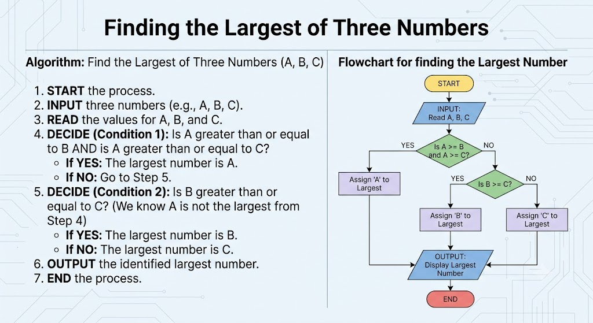

# python-tasks-JSOFT26038
College Python coursework solutions (JSOFT26038).

## Find the Largest of Three Numbers

### Algorithm
1. **START** the process.
2. **INPUT** three numbers ($A, B, C$).
3. **READ** the values for $A, B$, and $C$.
4. **DECIDE (Condition 1)**: Is $A \ge B$ AND $A \ge C$?
   - **If YES**: The largest number is $A$.
   - **If NO**: Go to Step 5.
5. **DECIDE (Condition 2)**: Is $B \ge C$?
   - **If YES**: The largest number is $B$.
   - **If NO**: The largest number is $C$.
6. **OUTPUT** the identified largest number.
7. **END** the process.

### Flowchart

---

## Program Index

| # | Program / Topic | File Name | Commit Message |
|---|----------------|-----------|----------------|
| 1 | **Add Two Numbers** | `add_function.py` | `feat: add script to calculate sum of two numbers using function arguments` |
| 2 | **Addition Output Practice** | `addition_output.py` | `feat: add script to print integer addition result` |
| 3 | **Basic Calculator** | `calculator.py` | `feat: add basic calculator script using input function` |
| 4 | **Even or Odd Check** | `even_odd_check.py` | `feat: add script to check if a number is even or odd` |
| 5 | **Input Explanation** | `explain_input.py` | `feat: add script to print the use of input function` |
| 6 | **Factorial Calculation** | `factorial.py` | `feat: add script to calculate factorial of a number` |
| 7 | **Fruit List Operations** | `fruit_list.py` | `feat: add script to manipulate fruit list elements` |
| 8 | **Grade Calculation** | `grade_check.py` | `feat: add script to determine grade based on 10th marks` |
| 9 | **Largest of Three Numbers** | `largest_of_3_numbers.py` | `feat: add algorithm, flowchart link, and script to find largest of three numbers` |
| 10 | **Leap Year Check** | `leap_year_check.py` | `feat: add script to check if a year is a leap year` |
| 11 | **Prime Number Check** | `prime_check.py` | `feat: add script to check if a number is prime` |
| 12 | **Python Data Types** | `print_datatypes.py` | `feat: add script identifying data types of variables` |
| 13 | **List vs Tuple (Sentence)** | `print_list_vs_tuple_sentence.py` | `feat: add script to print list vs tuple differences in sentence format` |
| 14 | **Print List Items** | `print_list.py` | `feat: add script to print list items using for loop` |
| 15 | **String Concatenation Output** | `print_string_sum.py` | `feat: add script demonstrating string concatenation output` |
| 16 | **For Loop Range (22 to 60)** | `range_loop.py` | `feat: add script using for loop for range 22 to 60` |